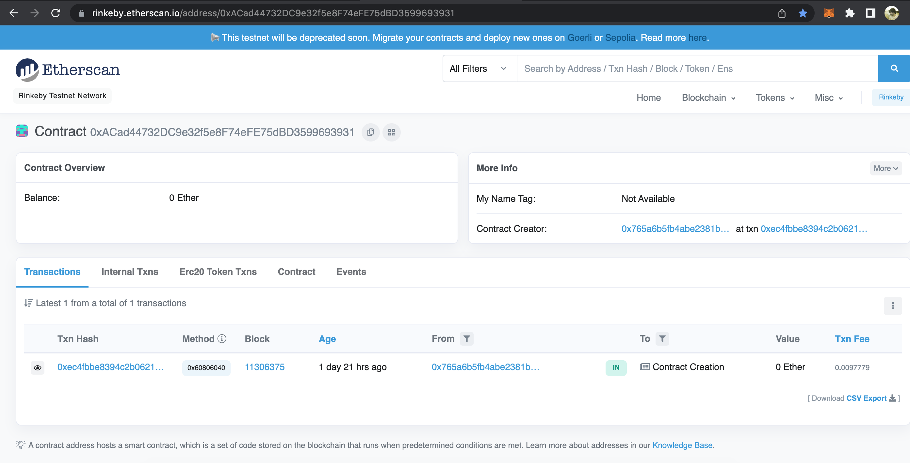
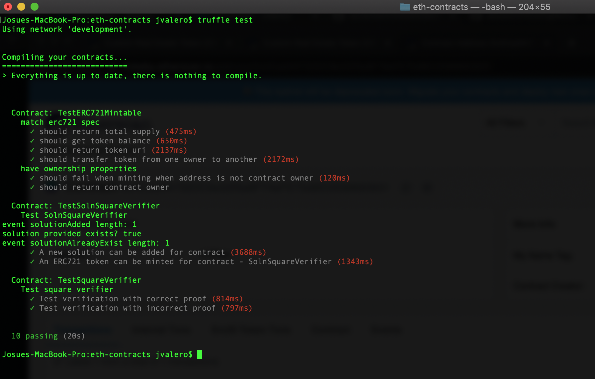
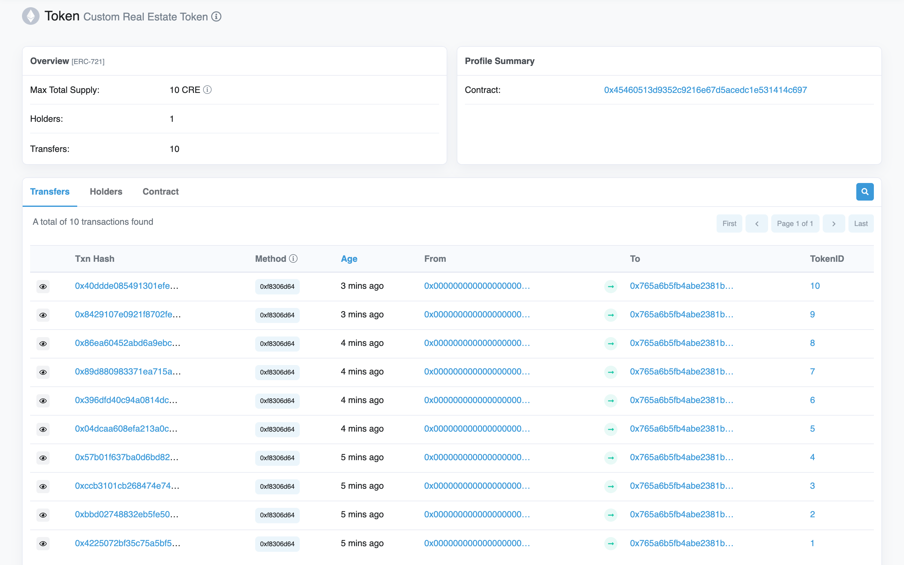
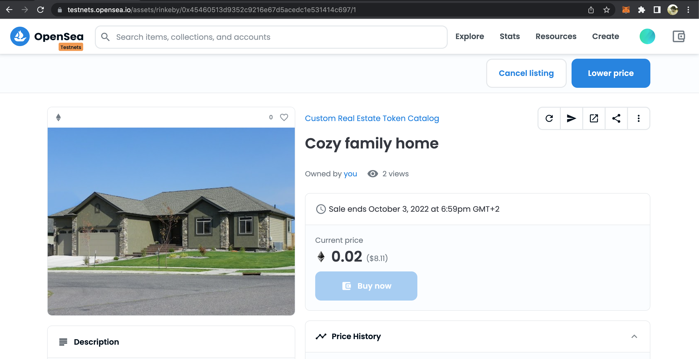
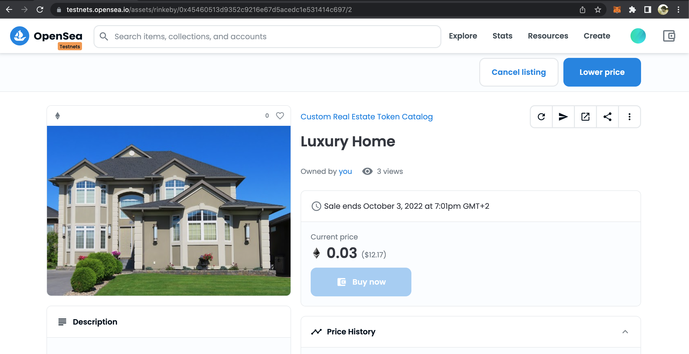
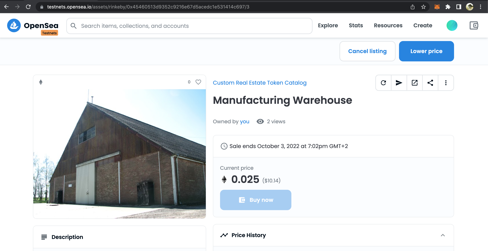
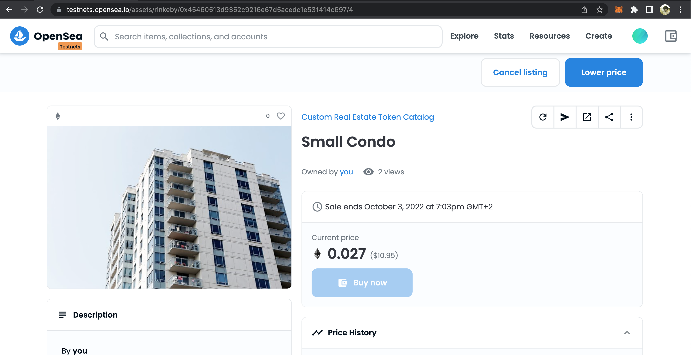
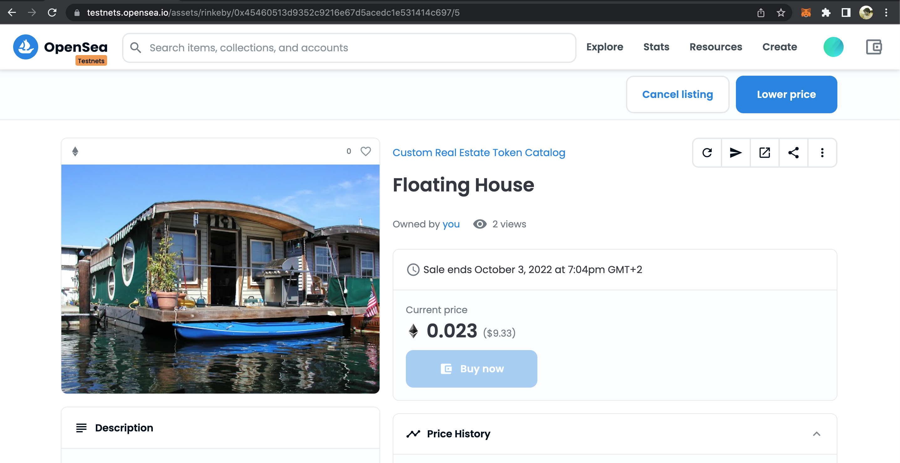
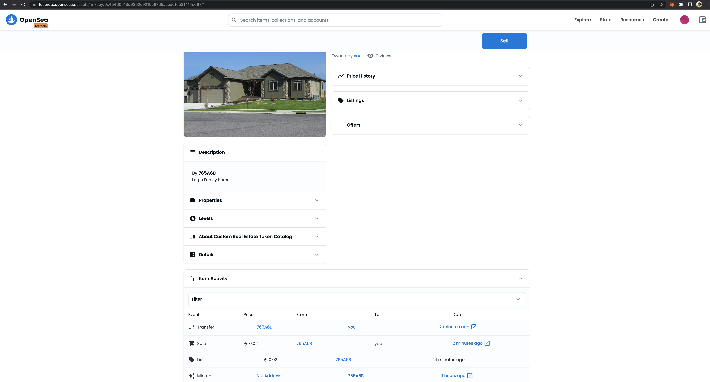
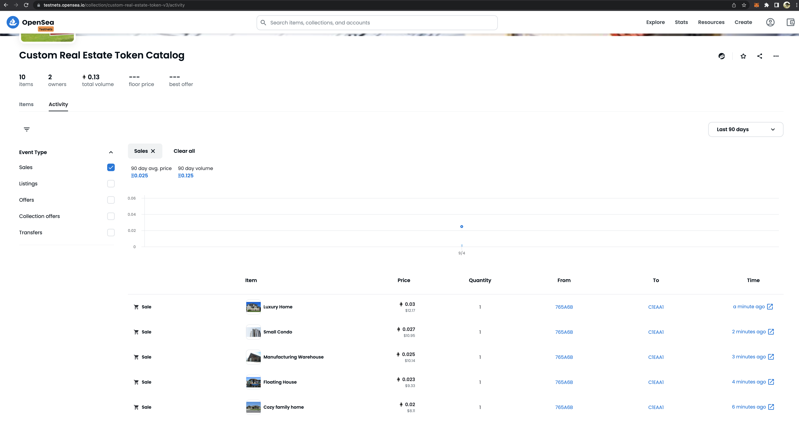

# Udacity Blockchain Capstone

The capstone will build upon the knowledge you have gained in the course in order to build a decentralized housing product.

At present, property titles are often paper-based, creating opportunities for errors and fraud. Any identified defect makes it illegal to transfer a property title to a buyer until it is rectified. This means property owners often incur high legal fees to ensure authenticity and accuracy of their property titles.

These title management issues could potentially be mitigated by using blockchain technology to build immutable digital records of land titles and using blockchain for transparent transactions. This approach could simplify property title management, making it more transparent and helping to reduce the risk of title fraud and the need for additional insurance.

In this project I am going to build my own token ERC721 compliant, named "Custom Real Estate Token" (CRE). To verify the ownership of the property that represents each token I will be using the Zero-knowledge proofs solution zkSnarks via a toolbox called ZoKrates.

The contract(s) will then be deployed on Ethereum's Rinkeby test network and 10 CRE tokens will be minted. To mint the tokens I use a script based on one used by Open sea's Open creatures NFT. (mint_tokens_creatures_rinkeby.js)

Once the tokens are minted I publish them on a catalog on Open sea testnet (https://testnets.opensea.io/) and list 5 of them for sale. Purchasing them subsequently with a different address from the one that owns them.

Lets see now some relevant screenshots and information covering the process:

- SolnSquareVerifier contract address on rinkeby: 0x45460513d9352c9216E67d5aCedc1E531414C697
- SolnSquareVerifier contract ABI (Contract that links the ERC721 compliant contract and the verifier contract that proofs we own the token)

[
  {
    "inputs": [
      {
        "internalType": "address",
        "name": "verifierAddress",
        "type": "address"
      }
    ],
    "payable": false,
    "stateMutability": "nonpayable",
    "type": "constructor"
  },
  {
    "anonymous": false,
    "inputs": [
      {
        "indexed": true,
        "internalType": "address",
        "name": "owner",
        "type": "address"
      },
      {
        "indexed": true,
        "internalType": "address",
        "name": "approved",
        "type": "address"
      },
      {
        "indexed": true,
        "internalType": "uint256",
        "name": "tokenId",
        "type": "uint256"
      }
    ],
    "name": "Approval",
    "type": "event"
  },
  {
    "anonymous": false,
    "inputs": [
      {
        "indexed": true,
        "internalType": "address",
        "name": "owner",
        "type": "address"
      },
      {
        "indexed": true,
        "internalType": "address",
        "name": "operator",
        "type": "address"
      },
      {
        "indexed": false,
        "internalType": "bool",
        "name": "approved",
        "type": "bool"
      }
    ],
    "name": "ApprovalForAll",
    "type": "event"
  },
  {
    "anonymous": false,
    "inputs": [
      {
        "indexed": false,
        "internalType": "address",
        "name": "trigger",
        "type": "address"
      }
    ],
    "name": "Paused",
    "type": "event"
  },
  {
    "anonymous": false,
    "inputs": [
      {
        "indexed": true,
        "internalType": "address",
        "name": "from",
        "type": "address"
      },
      {
        "indexed": true,
        "internalType": "address",
        "name": "to",
        "type": "address"
      },
      {
        "indexed": true,
        "internalType": "uint256",
        "name": "tokenId",
        "type": "uint256"
      }
    ],
    "name": "Transfer",
    "type": "event"
  },
  {
    "anonymous": false,
    "inputs": [
      {
        "indexed": false,
        "internalType": "address",
        "name": "trigger",
        "type": "address"
      }
    ],
    "name": "Unpaused",
    "type": "event"
  },
  {
    "anonymous": false,
    "inputs": [
      {
        "indexed": false,
        "internalType": "address",
        "name": "newOwner",
        "type": "address"
      }
    ],
    "name": "ownershipTransferred",
    "type": "event"
  },
  {
    "anonymous": false,
    "inputs": [
      {
        "indexed": true,
        "internalType": "address",
        "name": "submitter",
        "type": "address"
      }
    ],
    "name": "solutionAdded",
    "type": "event"
  },
  {
    "anonymous": false,
    "inputs": [
      {
        "indexed": true,
        "internalType": "address",
        "name": "submitter",
        "type": "address"
      }
    ],
    "name": "solutionAlreadyExist",
    "type": "event"
  },
  {
    "constant": false,
    "inputs": [
      {
        "internalType": "bytes32",
        "name": "_myid",
        "type": "bytes32"
      },
      {
        "internalType": "string",
        "name": "_result",
        "type": "string"
      }
    ],
    "name": "__callback",
    "outputs": [],
    "payable": false,
    "stateMutability": "nonpayable",
    "type": "function"
  },
  {
    "constant": false,
    "inputs": [
      {
        "internalType": "bytes32",
        "name": "_myid",
        "type": "bytes32"
      },
      {
        "internalType": "string",
        "name": "_result",
        "type": "string"
      },
      {
        "internalType": "bytes",
        "name": "_proof",
        "type": "bytes"
      }
    ],
    "name": "__callback",
    "outputs": [],
    "payable": false,
    "stateMutability": "nonpayable",
    "type": "function"
  },
  {
    "constant": false,
    "inputs": [
      {
        "internalType": "address",
        "name": "to",
        "type": "address"
      },
      {
        "internalType": "uint256",
        "name": "tokenId",
        "type": "uint256"
      }
    ],
    "name": "approve",
    "outputs": [],
    "payable": false,
    "stateMutability": "nonpayable",
    "type": "function"
  },
  {
    "constant": true,
    "inputs": [
      {
        "internalType": "address",
        "name": "owner",
        "type": "address"
      }
    ],
    "name": "balanceOf",
    "outputs": [
      {
        "internalType": "uint256",
        "name": "",
        "type": "uint256"
      }
    ],
    "payable": false,
    "stateMutability": "view",
    "type": "function"
  },
  {
    "constant": true,
    "inputs": [],
    "name": "baseTokenURI",
    "outputs": [
      {
        "internalType": "string",
        "name": "",
        "type": "string"
      }
    ],
    "payable": false,
    "stateMutability": "view",
    "type": "function"
  },
  {
    "constant": true,
    "inputs": [
      {
        "internalType": "uint256",
        "name": "tokenId",
        "type": "uint256"
      }
    ],
    "name": "getApproved",
    "outputs": [
      {
        "internalType": "address",
        "name": "",
        "type": "address"
      }
    ],
    "payable": false,
    "stateMutability": "view",
    "type": "function"
  },
  {
    "constant": true,
    "inputs": [],
    "name": "getOwner",
    "outputs": [
      {
        "internalType": "address",
        "name": "",
        "type": "address"
      }
    ],
    "payable": false,
    "stateMutability": "view",
    "type": "function"
  },
  {
    "constant": true,
    "inputs": [
      {
        "internalType": "address",
        "name": "owner",
        "type": "address"
      },
      {
        "internalType": "address",
        "name": "operator",
        "type": "address"
      }
    ],
    "name": "isApprovedForAll",
    "outputs": [
      {
        "internalType": "bool",
        "name": "",
        "type": "bool"
      }
    ],
    "payable": false,
    "stateMutability": "view",
    "type": "function"
  },
  {
    "constant": true,
    "inputs": [],
    "name": "name",
    "outputs": [
      {
        "internalType": "string",
        "name": "",
        "type": "string"
      }
    ],
    "payable": false,
    "stateMutability": "view",
    "type": "function"
  },
  {
    "constant": true,
    "inputs": [
      {
        "internalType": "uint256",
        "name": "tokenId",
        "type": "uint256"
      }
    ],
    "name": "ownerOf",
    "outputs": [
      {
        "internalType": "address",
        "name": "",
        "type": "address"
      }
    ],
    "payable": false,
    "stateMutability": "view",
    "type": "function"
  },
  {
    "constant": false,
    "inputs": [
      {
        "internalType": "address",
        "name": "from",
        "type": "address"
      },
      {
        "internalType": "address",
        "name": "to",
        "type": "address"
      },
      {
        "internalType": "uint256",
        "name": "tokenId",
        "type": "uint256"
      }
    ],
    "name": "safeTransferFrom",
    "outputs": [],
    "payable": false,
    "stateMutability": "nonpayable",
    "type": "function"
  },
  {
    "constant": false,
    "inputs": [
      {
        "internalType": "address",
        "name": "from",
        "type": "address"
      },
      {
        "internalType": "address",
        "name": "to",
        "type": "address"
      },
      {
        "internalType": "uint256",
        "name": "tokenId",
        "type": "uint256"
      },
      {
        "internalType": "bytes",
        "name": "_data",
        "type": "bytes"
      }
    ],
    "name": "safeTransferFrom",
    "outputs": [],
    "payable": false,
    "stateMutability": "nonpayable",
    "type": "function"
  },
  {
    "constant": false,
    "inputs": [
      {
        "internalType": "address",
        "name": "to",
        "type": "address"
      },
      {
        "internalType": "bool",
        "name": "approved",
        "type": "bool"
      }
    ],
    "name": "setApprovalForAll",
    "outputs": [],
    "payable": false,
    "stateMutability": "nonpayable",
    "type": "function"
  },
  {
    "constant": false,
    "inputs": [
      {
        "internalType": "bool",
        "name": "paused",
        "type": "bool"
      }
    ],
    "name": "setPaused",
    "outputs": [],
    "payable": false,
    "stateMutability": "nonpayable",
    "type": "function"
  },
  {
    "constant": true,
    "inputs": [
      {
        "internalType": "bytes4",
        "name": "interfaceId",
        "type": "bytes4"
      }
    ],
    "name": "supportsInterface",
    "outputs": [
      {
        "internalType": "bool",
        "name": "",
        "type": "bool"
      }
    ],
    "payable": false,
    "stateMutability": "view",
    "type": "function"
  },
  {
    "constant": true,
    "inputs": [],
    "name": "symbol",
    "outputs": [
      {
        "internalType": "string",
        "name": "",
        "type": "string"
      }
    ],
    "payable": false,
    "stateMutability": "view",
    "type": "function"
  },
  {
    "constant": true,
    "inputs": [
      {
        "internalType": "uint256",
        "name": "index",
        "type": "uint256"
      }
    ],
    "name": "tokenByIndex",
    "outputs": [
      {
        "internalType": "uint256",
        "name": "",
        "type": "uint256"
      }
    ],
    "payable": false,
    "stateMutability": "view",
    "type": "function"
  },
  {
    "constant": true,
    "inputs": [
      {
        "internalType": "address",
        "name": "owner",
        "type": "address"
      },
      {
        "internalType": "uint256",
        "name": "index",
        "type": "uint256"
      }
    ],
    "name": "tokenOfOwnerByIndex",
    "outputs": [
      {
        "internalType": "uint256",
        "name": "",
        "type": "uint256"
      }
    ],
    "payable": false,
    "stateMutability": "view",
    "type": "function"
  },
  {
    "constant": true,
    "inputs": [
      {
        "internalType": "uint256",
        "name": "tokenId",
        "type": "uint256"
      }
    ],
    "name": "tokenURI",
    "outputs": [
      {
        "internalType": "string",
        "name": "",
        "type": "string"
      }
    ],
    "payable": false,
    "stateMutability": "view",
    "type": "function"
  },
  {
    "constant": true,
    "inputs": [],
    "name": "totalSupply",
    "outputs": [
      {
        "internalType": "uint256",
        "name": "",
        "type": "uint256"
      }
    ],
    "payable": false,
    "stateMutability": "view",
    "type": "function"
  },
  {
    "constant": false,
    "inputs": [
      {
        "internalType": "address",
        "name": "from",
        "type": "address"
      },
      {
        "internalType": "address",
        "name": "to",
        "type": "address"
      },
      {
        "internalType": "uint256",
        "name": "tokenId",
        "type": "uint256"
      }
    ],
    "name": "transferFrom",
    "outputs": [],
    "payable": false,
    "stateMutability": "nonpayable",
    "type": "function"
  },
  {
    "constant": false,
    "inputs": [
      {
        "internalType": "address",
        "name": "newOwner",
        "type": "address"
      }
    ],
    "name": "transferOwnership",
    "outputs": [],
    "payable": false,
    "stateMutability": "nonpayable",
    "type": "function"
  },
  {
    "constant": false,
    "inputs": [
      {
        "internalType": "uint256[2]",
        "name": "a",
        "type": "uint256[2]"
      },
      {
        "internalType": "uint256[2][2]",
        "name": "b",
        "type": "uint256[2][2]"
      },
      {
        "internalType": "uint256[2]",
        "name": "c",
        "type": "uint256[2]"
      },
      {
        "internalType": "uint256[2]",
        "name": "input",
        "type": "uint256[2]"
      }
    ],
    "name": "addSolution",
    "outputs": [],
    "payable": false,
    "stateMutability": "nonpayable",
    "type": "function"
  },
  {
    "constant": true,
    "inputs": [
      {
        "internalType": "uint256[2]",
        "name": "a",
        "type": "uint256[2]"
      },
      {
        "internalType": "uint256[2][2]",
        "name": "b",
        "type": "uint256[2][2]"
      },
      {
        "internalType": "uint256[2]",
        "name": "c",
        "type": "uint256[2]"
      },
      {
        "internalType": "uint256[2]",
        "name": "input",
        "type": "uint256[2]"
      }
    ],
    "name": "solutionExist",
    "outputs": [
      {
        "internalType": "bool",
        "name": "",
        "type": "bool"
      }
    ],
    "payable": false,
    "stateMutability": "view",
    "type": "function"
  },
  {
    "constant": false,
    "inputs": [
      {
        "internalType": "address",
        "name": "to",
        "type": "address"
      },
      {
        "internalType": "uint256",
        "name": "tokenId",
        "type": "uint256"
      }
    ],
    "name": "mint",
    "outputs": [
      {
        "internalType": "bool",
        "name": "",
        "type": "bool"
      }
    ],
    "payable": false,
    "stateMutability": "nonpayable",
    "type": "function"
  },
  {
    "constant": false,
    "inputs": [
      {
        "internalType": "uint256[2]",
        "name": "a",
        "type": "uint256[2]"
      },
      {
        "internalType": "uint256[2][2]",
        "name": "b",
        "type": "uint256[2][2]"
      },
      {
        "internalType": "uint256[2]",
        "name": "c",
        "type": "uint256[2]"
      },
      {
        "internalType": "uint256[2]",
        "name": "input",
        "type": "uint256[2]"
      },
      {
        "internalType": "uint256",
        "name": "tokenId",
        "type": "uint256"
      },
      {
        "internalType": "address",
        "name": "to",
        "type": "address"
      }
    ],
    "name": "mint",
    "outputs": [],
    "payable": false,
    "stateMutability": "nonpayable",
    "type": "function"
  }
]

Verifier.sol contract generated from ZoKrates and deploy on rinkeby with address: 0xACad44732DC9e32f5e8F74eFE75dBD3599693931

Requested tests implemented and passing. To execute just run `truffle test` on eth-contracts folder.

To mint the 10 tokens just have to run the provided js script: `node mint_tokens_creatures_rinkeby.js`. The 10 proofs were generated beforehand via Zokrates and can be found under ./zokrates/code/square/proofs

The output of the script execution should look like this:

Minted Token. Transaction: 0x4225072bf35c75a5bf5493d3fa0fc1f7d31d9248cfa18c03bed5ebda655dd042
Minted Token. Transaction: 0xbbd02748832eb5fe50a275dc51209941a745689973b16b30723d6c7da1b72b55
Minted Token. Transaction: 0xccb3101cb268474e745790a05b368bb9d82741d341f7851415e2a3a6fe51f4ea
Minted Token. Transaction: 0x57b01f637ba0d6bd82dfe9e87251403ba43a49d5fc4c96f849c32a343fd59e42
Minted Token. Transaction: 0x04dcaa608efa213a0c52823ff192e15a8ee8ff0edd24a83e224008b009fd3169
Minted Token. Transaction: 0x396dfd40c94a0814dcbf041640289e1af9b99b33c9c6bca60bde68eb6234db1b
Minted Token. Transaction: 0x89d880983371ea715af860b63269e550d775b8b5c8a5019fc403bae030934e84
Minted Token. Transaction: 0x86ea60452abd6a9ebcffa1d38e7c59fda66248aa480c7350d8fd6494a146501c
Minted Token. Transaction: 0x8429107e0921f8702fe823af663964c37f9ba76e906736b41710c39515acbe29
Minted Token. Transaction: 0x40ddde085491301efe2d92011bc9ddfd6c47f3579299833ce03f2d365ac5767c

And the tokens should appear under the token contract:

Only two accounts have been used across the project:

    - Account to deploy the contracts and mint the tokens: 0x765A6B5fB4aBE2381bC2Be4928F3D09C978dc5BB
    - Account to buy the listed tokens for sale: 0xc1eaA1410d7360fddBc104471C72D0C037d214dd

Once the tokens have been minted on rinkeby, we can see on Open seas test net that they are already available in a catalog
on this URL: https://testnets.opensea.io/collection/custom-real-estate-token-v3 (V[N] is added by open sea on subsequent deployments of the Token contract).

Then the tokens can be listed for sale, I have put up for sale 5 of them:

Then with a different account (0xc1eaA1410d7360fddBc104471C72D0C037d214dd) I buy those 5 tokens:

# Project Resources

* [Remix - Solidity IDE](https://remix.ethereum.org/)
* [Visual Studio Code](https://code.visualstudio.com/)
* [Truffle Framework](https://truffleframework.com/)
* [Ganache - One Click Blockchain](https://truffleframework.com/ganache)
* [Open Zeppelin ](https://openzeppelin.org/)
* [Interactive zero knowledge 3-colorability demonstration](http://web.mit.edu/~ezyang/Public/graph/svg.html)
* [Docker](https://docs.docker.com/install/)
* [ZoKrates](https://github.com/Zokrates/ZoKrates)
